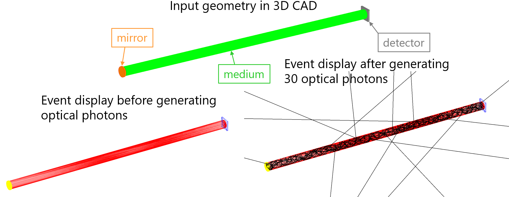
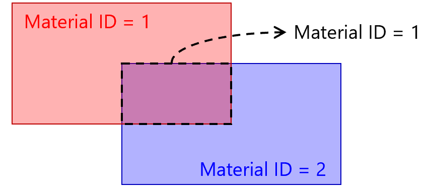
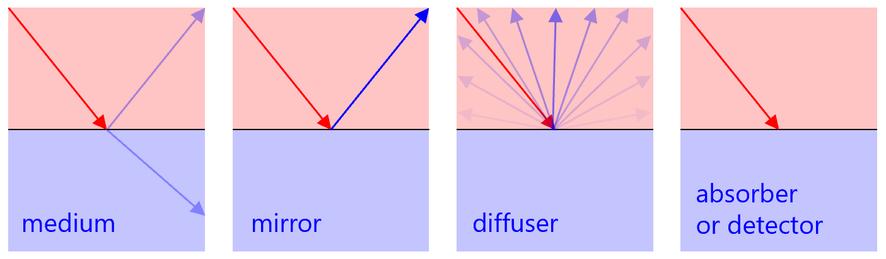

# Quick Optical Simulator

A Monte Carlo simulation code for optical photon behavior in 3D geometries.

## Overview

* Simulation conditions can be easily set via an input card file without recompiling.
* Geometry can be imported from various 3D CAD file formats.
* Fast simulation using dedicated, simple code and the Mersenne twister pseudorandom number generator.

## Table of Contents

1. [External Libraries](#1-external-libraries)
2. [Installation](#2-installation)
3. [Running the Simulation](#3-running-the-simulation)
4. [Geometry](#4-geometry)
5. [Input Card File](#5-input-card-file)
6. [Examples](#6-examples)
7. [Output ROOT File](#7-output-root-file)
8. [Simulation Process](#8-simulation-process)

## 1. External Libraries

### ASSIMP

* [ASSIMP](https://www.assimp.org/): A portable open source library to import various 3D model formats.
* Used to import material geometry for simulation from 3D model files.
* [Latest releases](https://github.com/assimp/assimp/releases)
* Version 5.4.3 tested.
* Documentation: [ASSIMP Docs](https://assimp-docs.readthedocs.io/en/latest/)

### ROOT

* [ROOT](https://root.cern.ch/): An object-oriented program and library developed by CERN.
* Used for simulation output (TFile/TTree) and event display.
* [Latest releases](https://root.cern/install/all_releases/)
* Version 6.34.08 tested.
* Documentation: [ROOT Manual](https://root.cern/manual/)

## 2. Installation

### ASSIMP

#### Build from source:

```sh
git clone https://github.com/assimp/assimp.git
cd assimp
cmake CMakeLists.txt
make
export ASSIMP=(path to ASSIMP)
export LD_LIBRARY_PATH=$LD_LIBRARY_PATH:${ASSIMP}/lib
```

#### Simple installation:

| OS     | Command                       |
| ------ | ----------------------------- |
| Ubuntu | `sudo apt-get install assimp` |
| Mac    | `brew install assimp`         |

### ROOT

#### Build or download:

* Download from [ROOT website](https://root.cern.ch/downloading-root).
* Set environment variables:

```sh
export ROOTSYS=(path to ROOT)
export PATH=${ROOTSYS}/bin:${PATH}
export LD_LIBRARY_PATH=${ROOTSYS}/lib:${LD_LIBRARY_PATH}
# Or:
source (path to ROOT)/bin/thisroot.sh
```

#### Simple installation:

| OS  | Command             |
| --- | ------------------- |
| Mac | `brew install root` |

### Optical Simulator

```sh
git clone https://github.com/tkikawa/optsim.git
cd optsim
make
```

## 3. Running the Simulation

### Usage

```sh
./OptSim [input card file] [output root file]
```

### Options

| Option | Description                           |
| ------ | ------------------------------------- |
| -s     | Set the random seed                   |
| -d     | Launch display mode                   |

### Display Mode

Visualizes the material geometry and tracks of charged particles and photons.

#### Material Geometry

| Material Type  | Display Color |
| -------------- | ------------- |
| medium         | Red           |
| converter      | Magenta       |
| mirror         | Yellow        |
| diffuser       | Green         |
| absorber       | Cyan          |
| detector       | Blue          |
| mixed material | Brown         |

#### Particle Track

| Particle         | Display Color |
| ---------------- | ------------- |
| Optical photon   | Black         |
| Charged particle | Dark red      |

#### Operation of Event Display

* Enter the number of particles and press the `generate` button to start the simulation.
* Display charged particle and photon tracks (in dark red and black, respectively).
* Save the event display by entering the file name and pressing the `save` button.
* Rotate, zoom, and unzoom using the mouse.



## 4. Geometry

* Import from [various 3D formats](https://github.com/assimp/assimp/blob/master/doc/Fileformats.md).
* Binary STL files are recommended.
* Can be created with most CAD software, e.g. [Autodesk Inventor](https://www.autodesk.co.jp/products/inventor/overview) or [SolidWorks](https://www.solidworks.com/) via "File - Save As..." using the STL file type.
* Set the unit to mm in CAD software; for other units (e.g., cm, m) adjust `cadunit` in `Global.hh`.
* Avoid too fine a resolution for CAD export.

### Example with SolidWorks

Several parts of a SolidWorks assembly can be exported as follows:

1. Select the part(s) to be exported and right-click.
2. Select "Invert selection" and then use "Suppress" on all other parts.
3. Now you can save that single part as STL (make sure the option "Do not translate STL output data to positive space" is checked and use the same coordinate system for every part, otherwise the different parts will not fit together).
4. You can check the positioning of the parts with, for example, [MeshLab](http://meshlab.sourceforge.net/), SolidView, Minimagics, Solidworks, etc.

## 5. Input Card File

* A text file specifying simulation parameters.
* Lines beginning with `#` are comments.
* See [input.card](https://github.com/tkikawa/optsim/blob/master/input.card) for examples.

### Global

| Parameter     | Description                                                               | Default  |
| ------------- | ------------------------------------------------------------------------- | -------- |
| Number        | Number of primary particles (photons or charged particles)                | 10000    |
| Index         | Refractive index of surroundings (air)                                    | 1.       |
| Mie           | Activate Mie scattering with asymmetric parameters                        | inactive |
| Scintillation | Activate scintillation with type, yield [photons/MeV] and life time [ns]  | inactive |
| Cherenkov     | Activate Cherenkov radiation with min. and max. wavelengths [nm]          | inactive |
| Efficiency    | Photon detection efficiency of detectors [0-1]                            | 1.       |

The generation of 1,000 primary particles with a refractive index of 1.0 for the surrounding medium, with activating the scintillation for NaI scintillation (photon yeild = 38000 photons/MeV) is defined as follows:

```txt
[Global]
Number 1000
Index 1.0
Scintillation NaI 38000
```

Following types of scintillators are available with default photon yield and life time.
| Name    | Description                                               | Yield [photons/MeV] | Life [ns] |
| ------- | --------------------------------------------------------- | ------------------- | --------- |
| organic | Organic scintillator like plastic or liquid scintillator. | 10000               | 2.1       |
| NaI     | Sodium iodide scintillator.                               | 38000               | 230.      |
| CsI     | Cesium iodide scintillator.                               | 65000               | 1000.     |
| BGO     | Bismuth germanate scintillator.                           | 8200                | 300.      |
| LYSO    | Cerium-doped lutetium yttrium orthosilicate scintillator. | 25000               | 50.       |
| LaBr3   | Cerium-doped lanthanum bromide scintillator.              | 63000               | 26.       |

### Material

* Material ID, CAD file name, and material type must be specified.
* Material properties need to be set for some types of materials.
* Different material IDs must be given for each material.
* When the geometries of two materials overlap, the material with the smaller ID is used in the overlapped region.



#### Material Type

| Material Type | Description                                                                           |
| ------------- | ------------------------------------------------------------------------------------- |
| medium        | Normal medium in which the photon transmits.                                          |
| scintillator  | Like medium, but the scintillation photons can be generated in charged particle mode. |
| converter     | Like medium, but the photon are isotropically scattered when it enters the material.  |
| mirror        | When the photon reaches the surface of the material, it is specularly reflected.      |
| diffuser      | When the photon reaches the surface of the material, it is diffusely reflected.       |
| absorber      | When the photon reaches the surface of the material, it is absorbed.                  |
| detector      | Like absorber, but tagged as detected in the output.                                  |

* A mixture of existing materials can also be defined to simulate the optical photons' behavior probabilistically.
* For example, a mixture of 70% reflector and 30% absorber can be defined as follows, which causes incoming photons to be reflected with 70% probability and absorbed with 30% probability.

```txt
[Material]
1 cover.stl 0.7 reflector 0.3 absorber
```

#### Material Properties

Properties that need to be or can be set for `medium` and `converter` materials:

| Material Property         | Mandatory/Optional | Unit          | Default      |
| ------------------------- | ------------------ | ------------- | ------------ |
| Refractive index          | Mandatory          | dimensionless | 1.           |
| Attenuation length        | Optional           | mm            | 0 (inactive) |
| Scattering length         | Optional           | mm            | 0 (inactive) |

* Add the values for the above parameters in the listed order after the Material Type.
* If any parameters are omitted, the default values shown in the table are applied.
* Scintillation probability and Cherenkov probability are valid only for charged particle mode.
* By default, Rayleigh scattering is activated by setting the scattering length to a non-zero value.
* A normal medium with refractive\_index = 1.592, attenuation\_length = 100 mm, no scattering can be defined as follows:

```txt
[Material]
1 scintillator.stl medium 1.592 100 0
```

### Primary Particle Generation

`Particle`, `Source` and `Direction` must be specified.

#### Particle

Defines the type of the primary particles.

| Type     | Description                    | Parameter            | Default parameter   |
| -------- | ------------------------------ | -------------------- | ------------------- |
| photon   | Optical photons as primaries.  | Polarization [0-1]   | 0 (no polarization) |
| electron | Electrons as primaries.        | Kinetic energy [MeV] | MIP energy          |
| muon     | Muons as primaries.            | Kinetic energy [MeV] | MIP energy          |
| pion     | Charged pions as primaries.    | Kinetic energy [MeV] | MIP energy          |
| kaon     | Charged kaons as primaries.    | Kinetic energy [MeV] | MIP energy          |
| proton   | Protons as primaries.          | Kinetic energy [MeV] | MIP energy          |

#### Source

Defines the position of the primary particles.

| Mode       | Description                   | Parameter                                          |
| ---------- | ----------------------------- | -------------------------------------------------- |
| CADvolume  | Uniform in a CAD volume       | CAD\_file\_name                                    |
| CADsurface | Uniform on a CAD surface      | CAD\_file\_name                                    |
| boxvolume  | Uniform in a box volume       | x\_min, x\_max, y\_min, y\_max, z\_min, z\_max     |
| boxsurface | Uniform on a box surface      | x\_min, x\_max, y\_min, y\_max, z\_min, z\_max     |
| cylvolume  | Uniform in a cylinder volume  | r\_min, r\_max, phi\_min, phi\_max, z\_min, z\_max |
| cylsurface | Uniform on a cylinder surface | r\_min, r\_max, phi\_min, phi\_max, z\_min, z\_max |
| sphvolume  | Uniform in a sphere volume    | x\_center, y\_center, z\_center, r                 |
| sphsurface | Uniform on a sphere surface   | x\_center, y\_center, z\_center, r                 |
| custom     | User's custom function        | (No parameter)                                     |

* Unit of x, y, z, r with subscripts is mm.
* Unit of phi with subscripts is degree.
* To generate particles on a specific coordinate plane (e.g., YZ), set the corresponding min and max values of the orthogonal axis equal (e.g., x\_min = x\_max).

#### Direction

Defines the direction of the primary particles.

| Mode      | Description                       | Parameter             |
| --------- | --------------------------------- | --------------------- |
| isotropic | Isotropic emission.               | (No parameter)        |
| lambert   | Lambertian emission (~cos\theta). | v\_x, v\_y, v\_z      |
| cosmic    | Cosmic-ray model (~cos^2\theta).  | v\_x, v\_y, v\_z      |
| flat      | Flat angular divergence.          | v\_x, v\_y, v\_z, phi |
| gauss     | Gaussian angular divergence.      | v\_x, v\_y, v\_z, phi |
| custom    | User's custom function            | (No parameter)        |

* v\_x, v\_y, v\_z represent the vector for central direction.
* Unit of phi is degree.
* phi in the `gauss` mode corresponds to the sigma of the Gaussian distribution.
* Set phi for `flat` or `gauss` to zero to simulate a beam in exactly the same direction.

#### Examples

Photon emission in the Z direction with a Gaussian angular divergence (sigma = 30 degrees) from a CAD volume can be defined as follows

```txt
[Particle]
photon

[Source]
CADvolume source.stl

[Direction]
gauss 0 0 1 30
```

### Custom function

When the custom mode is selected for source or direction mode, users can define arbitrary spatial or angular functions tailored to specific use cases.

| Function        | Description
| --------------- | ------------------------------------------------- |
| CustomSource    | Specify position of primary particles.            |
| CustomDirection | Specify direction of primary particles.           |

## 6. Examples

Example input card files and CAD files are available in the [examples directory](https://github.com/tkikawa/optsim/tree/master/examples).

## 7. Output ROOT File

The ROOT file contains a TTree \*photon for the interaction history of optical photons with the following branches:

| Branch   | Description                                                                                                     |
| -------- | --------------------------------------------------------------------------------------------------------------- |
| ipos\[3] | Initial position (x, y, z) in mm                                                                                |
| fpos\[3] | Final position (x, y, z) in mm                                                                                  |
| ivec\[3] | Initial direction (x, y, z)                                                                                     |
| fvec\[3] | Final direction (x, y, z)                                                                                       |
| ipol\[3] | Initial polarization (x, y, z)                                                                                  |
| fpol\[3] | Final polarization (x, y, z)                                                                                    |
| time     | Time from creation of primary particle to termination of photon in ns                                           |
| length   | Total photon path length in mm                                                                                  |
| imat     | Material ID at photon generation                                                                                |
| fmat     | Material ID at photon termination                                                                               |
| ftype    | End process (0: out of world, 1: reflection limit, 2: absorbed in medium, 3: absorbed by absorber, 4: detected) |
| nref     | Number of boundary reflections                                                                                  |
| npas     | Number of boundary transmissions                                                                                |
| id       | ID of corresponding charged particle. (only in charged particle mode)                                           |

In the charged particle mode, the ROOT file contains additional TTree \*charged for the track of charged particle with the following branches:

| Branch    | Description                                                                                                                                    |
| --------- | ---------------------------------------------------------------------------------------------------------------------------------------------- |
| ipos\[3]  | Initial position (x, y, z) in mm                                                                                                               |
| ivec\[3]  | Initial direction (x, y, z)                                                                                                                    |
| nph       | Number of produced photons by the charged particle                                                                                             |
| ntype\[5] | Number of photons in each end process ([0] out of world, [1] reflection limit, [2] absorbed in medium, [3] absorbed by absorber, [4] detected) |
| id        | ID of charged particle. (used to associate the charged particle information with photon information)                                           |

## 8. Simulation Process

The simulation procedure differs depending on the particle mode.

### Photon Mode

When the **particle mode is set to `photon`**, the following process is applied:

1. **Initial position and direction of each optical photon** are sampled according to the `[Source]` and `[Direction]` settings in the input card file.
2. For each optical photon, the simulation proceeds as follows:

   * Track and material boundary intersections are computed.
   * At each boundary:

     * **medium**: Reflection or refraction using Fresnel equations.
     * **converter**: Reflection or refraction using Fresnel equations, but the photon are isotropically scattered when it enters the material.
     * **mirror**: Specular reflection.
     * **diffuser**: Lambertian (cosine law) reflection.
     * **absorber/detector**: Absorbed or detected.
   * Inside each material, absorption or scattering is determined by the step length and material parameters.
   * This process repeats until the photon is absorbed or exits the world.



### Charged Particle Mode

When the **particle mode is set to `electron`, `muon`, `pion` or `proton`**:

1. **Initial position and direction of each charged particle** are sampled according to the `[Source]` and `[Direction]` settings in the input card file.
2. The passage of each charged particle through the geometry is simulated.
3. As the charged particle traverses the medium, the production of **scintillation photons** or **Cherenkov photons** is simulated based on Bethe–Bloch equation and Frank–Tamm formula, respectively.
4. For each generated optical photon:

   * **Initial position and direction** are determined according to the physical processes (e.g., random along the charged particle's path, appropriate angular distribution).
   * Each optical photon is then tracked through the geometry following the same procedure as in photon mode (steps 2 and onward above).

---

For further questions, consult the [GitHub repository](https://github.com/tkikawa/optsim) or the issue tracker.
