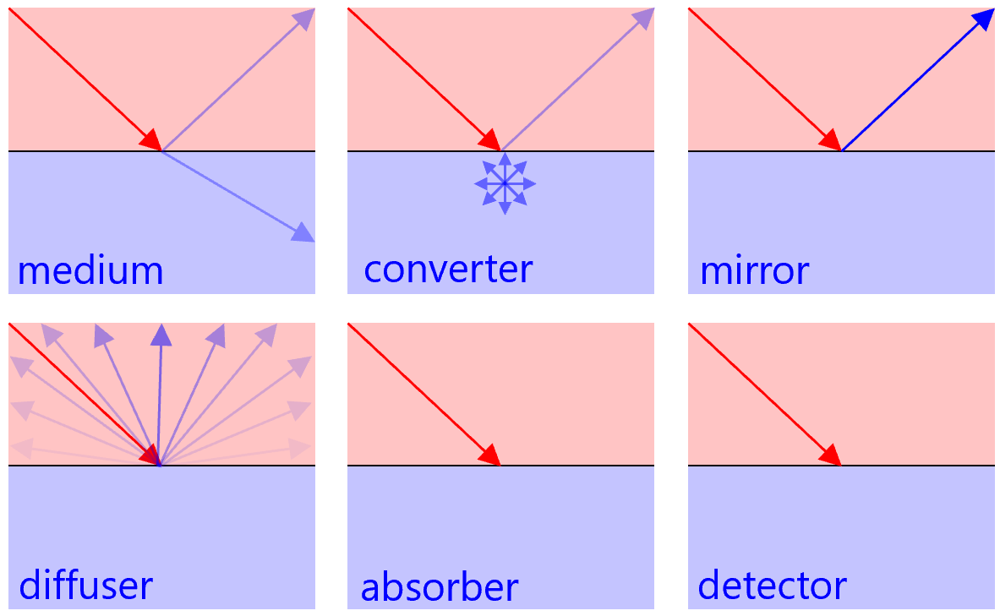

Quick optical simulator
========

This is a Monte Carlo simulation code for behavior of optical photons.
Advantages of this simulator are
- Simulation condition can be changed by editing an input card file without re-compiling the source code.
- Geometry can be easily imported from various formats of 3D CAD files.
- Relatively fast simulation because of a simple coding dedicated for the behavior of optical photons and the Mersenne twister pseudorandom number generator. [not yet quantitatively evaluated]

## 1. External libraries

### ASSIMP
[ASSIMP](https://www.assimp.org/index.php) is a portable open source library to import various well-known 3D model formats in a uniform manner. ASSIMP v.5.0.1 has been tested. ASSIMP code on SourceForge.net in which v.3.3.1 is the latest version is out of date. If you try to compile this version on Ubuntu, a compile error will occur. Please download the latest code from [GitHub](https://github.com/assimp/assimp/releases).
- [Documentations](https://assimp-docs.readthedocs.io/en/latest/)
- [Supported formats](https://github.com/assimp/assimp/blob/master/doc/Fileformats.md)
- [Latest releases](https://github.com/assimp/assimp/releases)
- [How to install](https://github.com/assimp/assimp/blob/master/Build.md)

### ROOT
[ROOT](https://root.cern.ch/) is an object-oriented program and library developed by CERN. Data is output as the ROOT format using TFile and TTree. ROOT v.6.18.04 was tested.
- [Documentations](https://root.cern/manual/)
- [Latest releases](https://root.cern/install/all_releases/)
- [How to install](https://root.cern/install/)

## 2. Installation

For the installation of ASSIMP, [cmake](http://www.cmake.org/) is used. The cmake version 3.0 or higher is required. (cmake v.2.6 is normally installed in Scientific Linux 6.)

### Installation of ASSIMP

- Download the codes from [ASSIMP GitHub](https://github.com/assimp/assimp/releases) and decompress it.
- cmake CMakeLists.txt
- make
- Set environment variables as follows.
    - export ASSIMP=(path to ASSIMP installation directory)
    - export LD_LIBRARY_PATH=$LD_LIBRARY_PATH:${ASSIMP}/lib

If you use Ubuntu, you can easiliy install it only with the following command.
- sudo apt-get install assimp

If you use Mac, you can easiliy install it only with the following command.
- sudo brew install assimp

### Installation of ROOT
- Download the binary file from [ROOT website](https://root.cern.ch/downloading-root) and decompress it.
- Set environment variables as follows.
    - export ROOTSYS=(path to ROOT installation directory)  
    - export PATH=${ROOTSYS}/bin:${PATH}  
    - export LD_LIBRARY_PATH=${ROOTSYS}/lib:${LD_LIBRARY_PATH}
- or
    - source (path to ROOT installation directory)/bin/thisroot.sh

If you use Mac, you can easiliy install it only with the following command.
- sudo brew install root

### Installation of this optical simulator

- Download the codes from [GitHub](https://github.com/tkikawa/optsim).
    - git clone https://github.com/tkikawa/optsim.git
- make

## 3. Run the simulation

### Usage
- ./OptSim [input card file] [output root file]

### Options
- -s : Set the seed of random number generator
- -d : Display mode

The Mersenne twister is used as the pseudorandom number generator.
Even when the seed for the generator is not given by users, it is given by a non-deterministic random number generator.

### Display mode
Display mode visualizes the material geometry and tracks of optical photons.
Meshes constituting the material geometry are displayed in different colors according to the type of the materials.
- **Red**: normal medium material
- **Magenta**: converter material
- **Yellow**: mirror material
- **Green**: diffuser material
- **Cyan**: absorber material
- **Blue**: detector material

When the display mode is launched, only the material geometry is displayed.
The display mode is interactive. Input positive integer to simulate and display the tracks of the optical photons.
The tracks are displayed in black.
Input "quit" or "exit" to terminate the display mode.
Input "save" to save the event display.
Input "gui" to switch to GUI control mode in which the event display can be rotated or cotrolled with mouse. Double click the event display to switch back to CUI control mode.

## 4. Geometry

### Material geometry

Material geometry can be imported from [various well-known 3D model formats](https://github.com/assimp/assimp/blob/master/doc/Fileformats.md).
Importation of [binary STL files](http://en.wikipedia.org/wiki/STL_%28file_format%29) was tested.
STL files use a list of triangles to describe 3D-surfaces. They can be created with most CAD software, e.g. [Inventor](https://www.autodesk.co.jp/products/inventor/overview) or [Solidworks](https://www.solidworks.com/) via "File - Save As..." using the STL file type.
Note the "Options..." button in the Save dialog, there you can change format (only binary supported), resolution, coordinate system, unit etc. The unit should be mm. In order to inport CAD files with different unit (e.g. cm, m), you need to change cadunit in Global.hh.

Do not choose a too high resolution. Usually, setting the deviation tolerance to a value small enough to represent every detail in your geometry and leaving angle tolerance at the most coarse setting is good enough. Low angle tolerance quickly increases triangle count and degeneracy.

If you want to export several parts of a Solidworks assembly you can do the following:

1. Select the part(s) to be exported and right-click.
2. Select "Invert selection" and then use "Suppress" on all other parts.
3. Now you can save that single part as STL (make sure the option "Do not translate STL output data to positive space" is checked and to use the same coordinate system for every part or else the different parts will not fit together).
4. You can check the positioning of the parts with e.g. [MeshLab](http://meshlab.sourceforge.net/), SolidView, Minimagics, Solidworks...

### Optical photon source

Optical photon source can be defined using 3D CAD files or manual parameter ranges. Directional distribution can also be conveniently defined in the input card file.

## 5. Input card file

Input for the simulation is a text file written in the prescribed format.
Line after # is commented out.
[input.card](https://github.com/tkikawa/optsim/blob/master/input.card) is an example of the format with explanations.
There are four categories.

### Global
Global information for the simulation.
- **Number**: Number of generated optical photons to be simulated. [default: 10000]
- **Index**: Refractive index of surroundings (air). [default: 1]

### Material
Material geometry information. Material ID, location of the CAD-file and material type must be specified. When the geometries of two materials overlaps, the material with small ID stands in the overlapped region. The available material types are as follows.
- **medium**: Normal medium in which the optical photon transmits. Refractive index and attenuation length (mm) for the absorption in the medium must be specified. The absorption can be inactivated by giving 0 for the attenuation length.
- **converter**: The behavior is the same as medium except that the optical photon is isotropically scattered when it enters this material. Response of wavelength converter (shifter) can be reproduced with this material type.
- **mirror**: When the optical photon reaches the surface the material, it is specularly reflected.
- **diffuser**: When the optical photon reaches the surface the material, it is diffusely reflected.
- **absorber**: When the optical photon reaches the surface the material, it is absorbed.
- **detector**: The behavior in the simulation is the same as absorber but is tagged as detected in the output ROOT file.

### Source
Initial positional distribution of the generated optical photons.
Following source modes are available.
- **CADvolume**: Source volume is given by a CAD file. Photons are uniformly created in the space completely surrounded by surface of the CAD file.
- **CADsurface**: Starting points are on triangles whose vertices are all in the given CAD-volume.
- **boxvolume**: Photon starting values are uniformly diced in a box volume with the given parameter range (x,y,z).
- **cylvolume**: Photon starting values are uniformly diced in a cylindrical volume with the given parameter range (r,phi,z).
- **cylsurface**: Photon starting values are uniformly diced in the surface of cylinder with the given parameter range (r,phi,z).

### Direction
Initial directional distribution of the generated optical photons.
Following direction modes are available.
- **isotropic**: Photons are emitted isotropically.
- **flat**: Photons are directionally emitted with a divergence angle of flat distribution (v_x, v_y, v_z, phi).
- **gauss**: Photons are directionally emitted with a divergence angle of Gaussian distribution (v_x, v_y, v_z, phi).

## 6. Examples
As examples of input for this optical simulator, several sets of input card file and CAD files for the geometry are prepared in [examples directory](https://github.com/tkikawa/optsim/tree/master/examples).

## 7. Output ROOT file

The output ROOT file has a TTree *tree and branches shown below.
- **ipos[3]**: Initial position of optical photon (mm). [0], [1], [2] for x, y, z.
- **fpos[3]**: Final position of optical photon (mm). [0], [1], [2] for x, y, z.
- **ivec[3]**: Initial direction of optical photon (mm). ([0], [1], [2] for x, y, z.
- **fvec[3]**: Final direction of optical photon (mm). [0], [1], [2] for x, y, z.
- **time**: Time from generation to end of optical photon (ns).
- **length**: Total path length traveled by optical photon (mm).
- **imat**: Material ID in which optical photon was generated.
- **fmat**: Material ID in which optical photon ended.
- **ftype**: ID which identifies how optical photon ended.
    - 0: Go out of world volume.
    - 1: Exceed limit of reflections    
    - 2: Absorbed in normal medium.
    - 3: Absorbed by absorber.
    - 4: Detected by detector.
- **nref**: Number of reflections of optical photon in boundaries.
- **npas**: Number of transmissions of optical photon in boundaries.

## 8. Simulation process

Initial position and direction of the optical photon are determined based on [Source] and [Direction] of input card file.
Intersection of the track and boundary of the material is obtained.
The intersection is regarded as the new position. The new direction is determined based on the boundary condition.
- **To medium**: Optical photon is reflected or transmit with refraction in the boundary following the Fresnel equations.
- **To mirror**: Optical photon is specularly reflected in the boundary.
- **To diffuser**: Optical photon is diffusely reflected in the boundary following the Lambert's cosine law.
- **To absorber or detector**: Optical photon is absorbed in the boundary.

In each step, probabilities of absorption or scattering in the material are calculated from the path length of the step, average absorption or scattering lengths.
Following the probabilities, the optical photon is sometimes absorbed or scattered in the material.
This process is repeated until the optical photon is absorbed or go out of the world volume.
