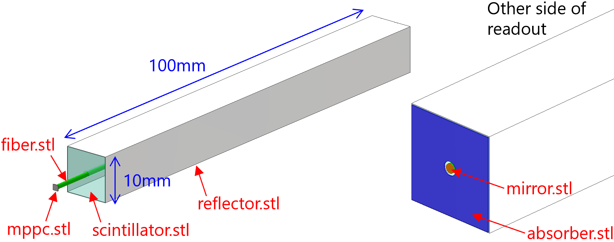
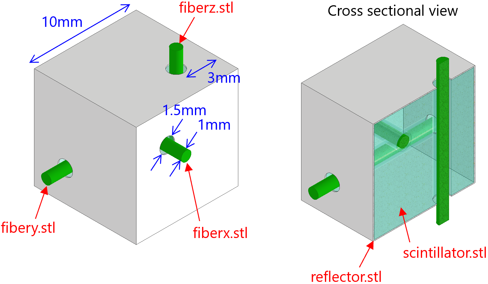
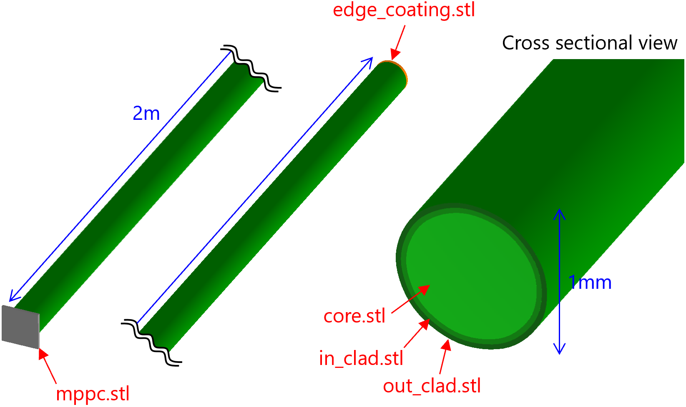
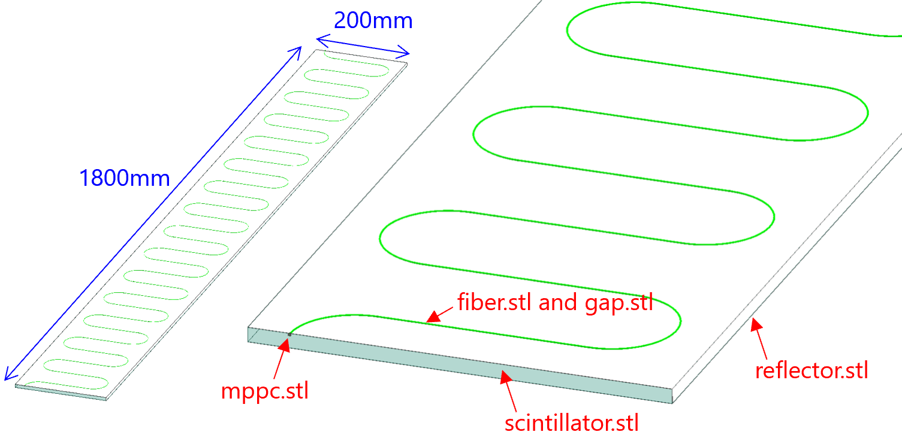
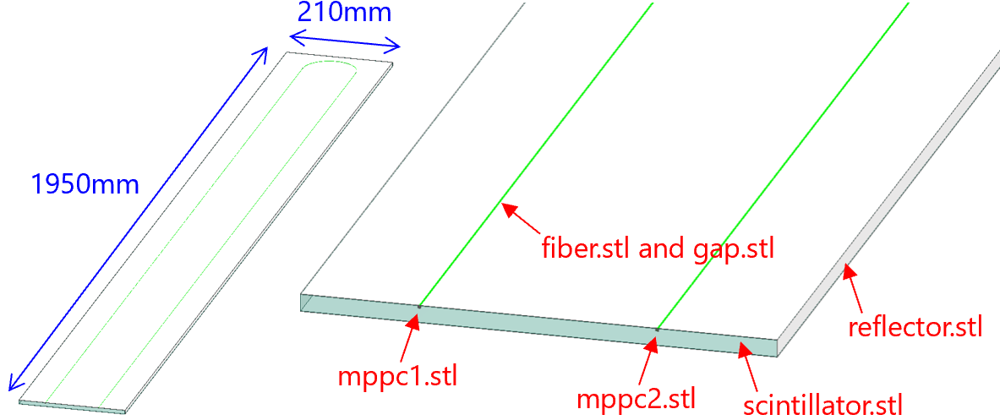
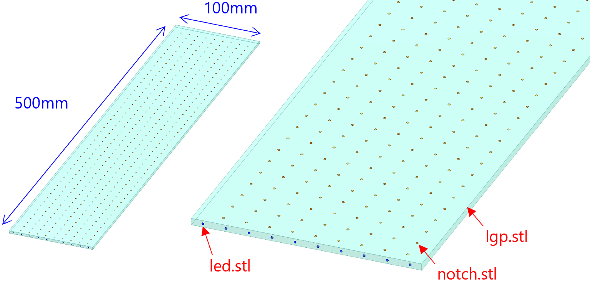

Examples of input files
========

As examples of input for this optical simulator, several sets of input card file and CAD files for the geometry are prepared.

## 1. [Simple geometry](https://github.com/tkikawa/optsim/tree/master/examples/simple)

Example of a simple geometry including all kinds of materials (normal medium, converter, mirror, diffuser, absorber and detector).
A 1cm * 1cm * 10cm scintillator bar is defined as medium with index=1.592 and att.length=100mm and no scattering.
It is surrounded by reflector coating with is defined as reflector.
1.0mm fibers go through a 1.5 diameter-hole drilled on the center of the scintillator.
A detector is placed on one end of the fiber and a mirror is plaecd on the other end of the fiber.
A absorber is placed on the same side of the scintillator as the mirror.
The scintillator volume is defined as the optical photon source.
Command to run the simulation with this example is  
./OptSim examples/simple/input.card output.root

## 2. [Cubic scintillator for Super-FGD](https://github.com/tkikawa/optsim/tree/master/examples/sfgd_cube)

Example of 1cm * 1cm * 1cm cubic scintillator used for Super-FGD.
The scintillator is defined as medium with index=1.592 and att.length=30mm and no scattering.
It is surrounded by reflector coating with is defined as reflector.
1.0mm fibers go through 1.5 diameter-holes drilled on the scintillator.
The fibers are defined as detector in order to estimate the light collection efficiency to the fibers.
The scintillator volume is defined as the optical photon source.
Command to run the simulation with this example is  
./OptSim examples/sfgd_cube/input.card output.root

## 3. [Double-clad optical fiber](https://github.com/tkikawa/optsim/tree/master/examples/fiber)

Example of 1mm-diameter double-clad optical fiber.
The length of the fiber is 2m which is the same as FGD or Super-FGD's wavelength shifting fiber.
The fiber is made of core(index=1.59), inner clad(index=1.49) and outer clad(index=1.42), and att.length=3500mm and no scattering for all of them.
They are properties of [Kuraray's double-clad fiber](https://www.kuraray.co.jp/uploads/5a717515df6f5/PR0150_psf01.pdf).
The fiber core volume is defined as the optical photon source.
A detector is placed on one end of the fiber.
Several input card files are prepared to simulate the several options of the coating on the other side of the fiber.
- input_nocoating.card: The other side of the fiber is not coated, and it is exposed to air.
Command to run the simulation with this example is  
./OptSim examples/fiber/input_nocoating.card output.root
- input_mirror.card: The other side of the fiber is coated with mirror.
Command to run the simulation with this example is  
./OptSim examples/fiber/input_mirror.card output.root
- input_diffuser.card: The other side of the fiber is coated with diffuser.
Command to run the simulation with this example is  
./OptSim examples/fiber/input_diffuser.card output.root
- input_absorber.card: The other side of the fiber is coated with absorber.
Command to run the simulation with this example is  
./OptSim examples/fiber/input_absorber.card output.root

## 4. [Scintillator with wavy fiber for Wall MRD](https://github.com/tkikawa/optsim/tree/master/examples/wall_mrd)

Example of scintillator with wavy fiber for Wall MRD.
The scintillator is defined as medium with index=1.592 and att.length=100mm and no scattering.
It is surrounded by reflector coating with is defined as reflector.
A Wavy fiber goes through the scintillator.
Detectors are attached on the both sides of the fiber.
The scintillator volume is defined as the optical photon source.
Command to run the simulation with this example is  
./OptSim examples/wall_mrd/input.card output.root

## 5. [Scintillator with U-shape fiber for Baby MIND](https://github.com/tkikawa/optsim/tree/master/examples/baby_mind)

Example of scintillator with U-shape fiber for Baby MIND.
The scintillator is defined as medium with index=1.592 and att.length=100mm and no scattering.
It is surrounded by reflector coating with is defined as reflector.
A Wavy fiber goes through the scintillator.
Detectors are attached on the both sides of the fiber.
The scintillator volume is defined as the optical photon source.
Command to run the simulation with this example is  
./OptSim examples/baby_mind/input.card output.root

## 5. [LGP calibration system for Super-FGD](https://github.com/tkikawa/optsim/tree/master/examples/lgp)

Example of LGP calibration system for Super-FGD.
The LGP is defined as medium with index=1.592 and att.length=5000mm and no scattering.
Under the LGP, there are notches which are defined as diffuser.
The led volume is given in the edge of the LGP and it is defined as the optical photon source.
On the top of the LGP, detector is placed to see the photon distribution on the top.
Command to run the simulation with this example is  
./OptSim examples/lgp/input.card output.root

